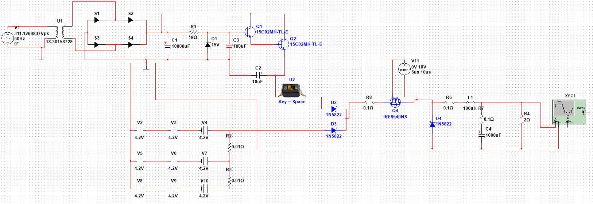

# Server_UPS_Module
Schematic design and simulation files for a custom, high-reliability Uninterruptible Power Supply (UPS) engineered for community server infrastructure.
# Uninterruptible Power Supply (UPS) for Community Server

## 📌 Project Overview
This repository contains the schematic design and simulation files for a custom Uninterruptible Power Supply (UPS) system. The project is specifically engineered to safeguard community server infrastructure against sudden power interruptions, ensuring zero downtime and continuous data integrity.

> **⚠️ Current Status: Under Active Development**
> *This system is currently in the simulation and component specification phase. The ultimate design goal is long-term, 24/7 flawless operation under continuous load. To achieve this, the final hardware implementation will strictly utilize industrial-grade components selected for maximum durability, thermal resilience, and extended lifecycle.*

## ⚡ System Architecture & Schematic

The electrical architecture has been modeled and validated using advanced circuit simulation tools (Multisim). The design features a robust switchover mechanism and highly regulated output stages.

### Core Subsystems:
1. **AC-DC Conversion & Charging Stage:** * Steps down and rectifies standard grid AC voltage.
   * Utilizes a highly filtered linear regulation stage to safely charge and maintain the backup battery bank.
2. **Battery Bank Array:** * Modeled around a **3S Li-ion** configuration (simulated via series/parallel voltage sources) to provide sufficient backup runtime and rapid discharge capabilities during a blackout.
3. **Power Path Management (OR-ing):** * Seamless transition between main grid power and battery backup is achieved via a fast-switching Schottky diode network (`1N5822`), preventing reverse currents and ensuring immediate power delivery when the grid fails.
4. **DC-DC Buck Converter Output:** * A high-efficiency buck converter stage driven by a PWM-controlled P-Channel MOSFET (`IRF9540NS`) and a tuned LC filter (`100uH` inductor, `1000uF` capacitor).
   * Ensures the server load receives a perfectly stable and clean DC voltage, completely immune to grid fluctuations.

## 🚀 Future Roadmap & Durability Focus
As the project transitions from simulation to physical PCB layout, the engineering focus is strictly on **long-term reliability**:
* **Component Selection:** Sourcing high-MTBF (Mean Time Between Failures) capacitors, heavy-duty inductors, and high-temperature-rated MOSFETs.
* **Thermal Management:** Implementing comprehensive heat dissipation strategies (heatsinks, thermal vias) for the switching and regulation stages.
* **Protection Circuits:** Adding over-current (OCP), over-voltage (OVP), and deep-discharge protection layers to maximize battery life and server safety.
